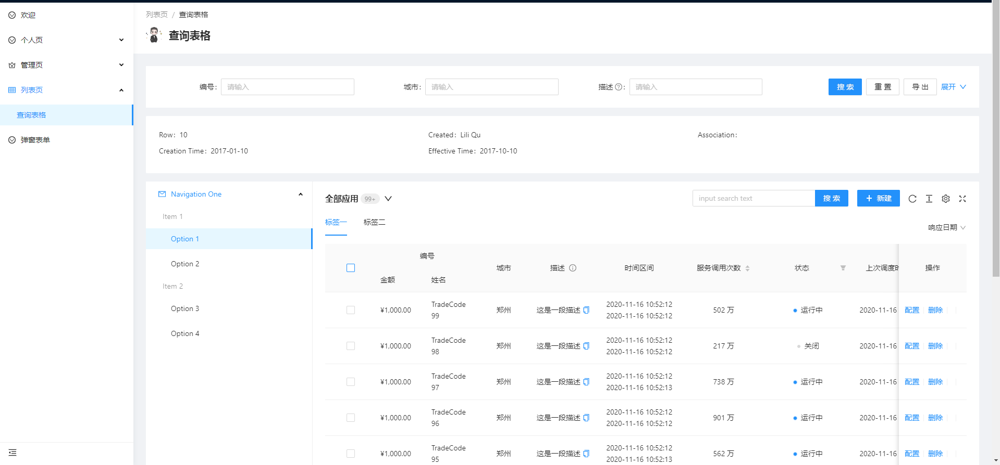
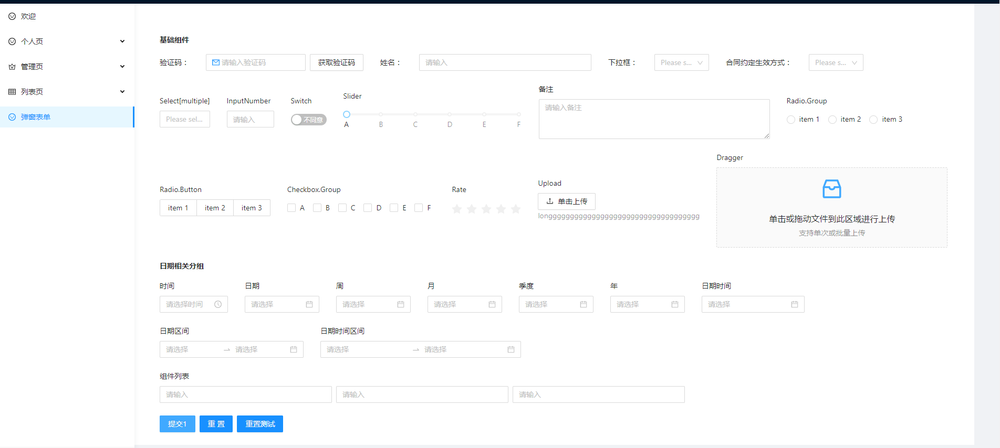

###  extends ProTableCustom 表格使用

```js

import { PureComponent, createRef } from 'react';

class TableTools extends PureComponent {

    constructor(props) {
        super(props);
        this.state = {
            /**
             * 新建弹窗表单Visible
             */
            createModalVisible: false,

            /**
             * 更新弹窗表单 Visible
             */
            updateModalVisible: false,

            /**
             * 获取更新数据 values 
             */
            updateFormValues: null,

            /**
             * 表格多选行数据
             */
            selectedRows: [],

            /**
             * 表格多选key值
             */
            selectedRowKeys: [],
        };
    }

    /*
     * 默认的操作栏配置，设为 false 时不显示  
     */
    options = { fullScreen: true, reload: true, setting: true };

    /*
     * 不同屏幕显示方式
     */
    defaultColConfig = {
        xs: 24,
        sm: 24,
        md: 12,
        lg: 12,
        xl: 8,
        xxl: 6,
    };

    /*
    * 新增弹框
    */
    onAdd = (visible) => {
        this.setState({ createModalVisible: visible });
    };

    /*
     * 修改表单弹窗
     * @param {} visible
     */
    onUpdate = (visible) => {
        this.setState({ updateModalVisible: visible });
    };

    /*
     * 头部显示内容配置
     */
    pageHeaderContent = () => null;

    /*
     * 显示头部扩展表单
     */
    renderCustomFormContent = () => null;

    /*
    * 左上角的 title
    */
    headerTitle = () => '高级表格';

    /*
     * 数据加载失败
     */
    onRequestError = (error) => { };

    /*
     * 格式化搜索表单提交数据
     * @param {搜索参数} params
     */
    beforeSearchSubmit = (params) => {
        // console.log(params)
        return params;
    };

    /**
     * 分页配置 false 不显示分页
     */
    pagination = {
        showQuickJumper: false, //是否显示跳转页
        pageSize: 10, //配置默认显示数据条数
    };

    /**
     * 加载更多
     */
    fetchMore = () => {
        if (this.actionRef.current) {
            this.actionRef.current.fetchMore();
        }
    };

    /**
     * 刷新数据
     */
    reloadData = () => {
        if (this.actionRef.current) {
            this.actionRef.current.reload();
        }
    };

    /**
     * 重置到默认状态
     */
    fromReset = () => {
        if (this.actionRef.current) {
            this.actionRef.current.reset();
        }
    };

    /**
     * 重置表单事件
     */
    resetFn = () => {
        console.log('重置表单');
    };

    /**
     * 清空选中项
     */
    clearSelected = () => {
        if (this.actionRef.current) {
            this.actionRef.current.clearSelected();
        }
    };

    /**
     * 批量操作选择
     * @param {选择key*} selectedRowKeys
     * @param {选择的行数据*} selectedRows
     */
    handleSelectRows = (selectedRowKeys, selectedRows) => {
        console.log(selectedRowKeys);

        this.setState({
            selectedRows: selectedRows,
            selectedRowKeys,
        });
    };

    /**
     * 清空选择数据
     */
    cleanSelectedRows = () => {
        this.setState({ selectedRows: [] });
    };

    /**
     * 重写表格列表配置
     */
    getColumn = () => [];

    /**
     * 表单提交
     * @param {*} value 
     */
    handleAdd = (value) => { };

    /**
     * 修改表单提交
     * @param {修改表单提交} value 
     */
    handleUpdate = (value) => { };

    /** 
     * 修改方法获取数据更新
     * @param {*} record
     */
    setUpdateFormValues = (record) => {
        this.setState({
            updateFormValues: record,
        });
    };

    /**
     * 批量删除
     * @param {*} selectedRowKeys 
     * @param {*} selectedRows 
     */
    handleBatchDelete = (selectedRowKeys, selectedRows) => {
        console.log(selectedRowKeys);
        this.cleanSelectedRows();
        this.actionRef.current?.reloadAndRest?.();
    };

}

export default TableTools


import React, { PureComponent, createRef, CSSProperties } from 'react';
import { PlusOutlined, MailOutlined } from '@ant-design/icons';
import { Button, Badge, Space, BackTop, Tag, message, Input, Descriptions, Menu } from 'antd';
import { LightFilter, ProFormDatePicker } from '@ant-design/pro-form';
import ProCard from '@ant-design/pro-card';
import { PageContainer, FooterToolbar } from '@ant-design/pro-layout';
import ProTable from '@ant-design/pro-table';
import CreateForm from './components/CreateForm';
import UpdateForm from './components/UpdateForm';
import TableTools from './/components/TableTools'
import styles from './index.less'

class ProTableCustom extends TableTools {

  constructor(props) {
    super(props);
    this.state = {

    };
  }

  /**
  * Table action 的引用，便于自定义触发
  */
  actionRef = createRef();

  /**
   * 可以获取到查询表单的 form 实例，用于一些灵活的配置
   */
  formRef = createRef();

  /**
   * 自定义 table 的 alert
   * 设置或者返回false 即可关闭
   */
  tableAlertOptionRender = ({ selectedRowKeys, selectedRows, onCleanSelected }) => {
    return (
      <Space size={16}>
        {/* <a>导出数据</a> */}
        <a style={{ marginLeft: 8 }} onClick={onCleanSelected}>
          取消选择
        </a>
      </Space>
    );
  };

  /**
   * 表格数据配置
   */
  dataSource = [];

  /**
   * 对request 请求数据进行处理
   * @param {*} data
   */
  postFn = (data) => {
    let array = data;
    for (let index = 0; index < array.length; index++) {
      array[index].city = '郑州';
    }
    // console.log(array)
    return array;
  };


  /**
   * 设置搜索显示不显示search=false
   */
  tableSearchProps = {
    labelWidth: 120, //标签的宽度
    span: this.defaultColConfig, //搜索栏显示方式
    searchText: '搜索',
    resetText: '重置',
    defaultCollapsed: true,//设置面板默认值
  }

  /**
   * 搜索按钮菜单重写
   * @param {*} param0 
   * @param {*} param1 
   */
  optionRender = () => {
    return [
      <Button key="out">导出</Button>,
    ]
  }

  onCollapse = (collapsed) => {
    this.setState({
      collapsedState: collapsed
    })
    console.log(collapsed)
  }

  // collapseRender = (collapsed, showCollapseButton) => {
  //   console.log(collapsed)
  //   return (
  //     <div>
  //       {showCollapseButton.submitter}
  //     </div>
  //   )
  // }

  tableSearch = () => {
    const { collapsedState, showCollapseRender } = this.props
    return {
      ...this.tableSearchProps,
      //搜索栏工具重写
      optionRender: ({ searchText, resetText }, { form }) => {
        return [
          <Button
            key="searchText"
            type="primary"
            onClick={() => {
              form?.submit();
            }}
          >
            {searchText}
          </Button>,
          <Button
            key="resetText"
            onClick={() => {
              form?.resetFields();
            }}
          >
            {resetText}
          </Button>,
          ...this.optionRender(),
        ]
      },
      collapsed: collapsedState,  //是否收起
      // // 是否收起事件
      onCollapse: this.onCollapse,
      // //收起按钮配置
      // collapseRender: this.collapseRender
    };
  }


  /**
   * 搜索表单数据获取antd form 的配置
   */
  form = {
    onValuesChange: (values, all) => {
      console.log(values, all);
    },
  };

  /**
   * 表格嵌套
   */
  expandedRowRender = () => {
    const data = [];
    for (let i = 0; i < 3; i += 1) {
      data.push({
        key: i,
        date: '2014-12-24 23:12:00',
        name: 'This is production name',
        upgradeNum: 'Upgraded: 56',
      });
    }
    return (
      <ProTable
        columns={[
          {
            title: 'Date',
            dataIndex: 'date',
            key: 'date',
          },
          {
            title: 'Name',
            dataIndex: 'name',
            key: 'name',
          },
          {
            title: 'Upgrade Status',
            dataIndex: 'upgradeNum',
            key: 'upgradeNum',
          },
          {
            title: 'Action',
            dataIndex: 'operation',
            key: 'operation',
            valueType: 'option',
            render: () => [<a key="Pause">Pause</a>, <a key="Stop">Stop</a>],
          },
        ]}
        headerTitle={false}
        search={false}
        options={false}
        dataSource={data}
        pagination={false}
      />
    );
  };

  renderBadge = (count) => (
    <Badge
      count={count}
      style={{
        marginTop: -4,
        marginLeft: 4,
        color: '#999',
        backgroundColor: '#eee',
      }}
    />
  );

  /**
   * toolbar工具栏配置filter
   */
  toolbarFilter = () => {
    return (
      <LightFilter
        style={{
          marginTop: 8,
        }}
      >
        <ProFormDatePicker name="startdate" label="响应日期" />
      </LightFilter>
    )
  }

  /**
   * toolbar工具栏配置tabs配置
   */
  toolbarTabs = () => {
    return {
      onChange: (activeKey) => {
        console.log(activeKey)
      },
      activeKey: 'tab2',
      items: [
        {
          key: 'tab1',
          tab: '标签一',
        },
        {
          key: 'tab2',
          tab: '标签二',
        },
      ],
    }
  }

  /**
   * toolbar工具栏actions配置
   */
  toolbarActions = () => {
    return [
      <Button type="primary" key="newButton" onClick={() => this.onAdd(true)}>
        <PlusOutlined /> 新建
     </Button>,
    ]
  }

  /**
   * toolbar 菜单配置
   */
  toolbarMeun = () => {
    return {
      type: 'dropdown', //'inline' | 'dropdown'
      // activeKey: 'todo',
      onChange: (activeKey) => {
        this.activeKey = activeKey
        console.log(activeKey)
      },
      items: [
        {
          label: <span>全部应用{this.renderBadge(101)}</span>,
          key: 'all',
        },
        {
          label: <span>我创建的应用{this.renderBadge(3)}</span>,
          key: 'todo',
        },
      ],
    }
  }

  /**
   * 全局搜索事件
   * @param {*} keyWords 
   */
  onSearchKeyWords = (keyWords) => {
    console.log(keyWords)
  }

  /**
   * toolbar 搜索显示配置 
   */
  toolbarSearch = {
    loading: false,
    enterButton: '搜索',
    placeholder: "input search text",
    allowClear: true,
    style: { width: 300 },
    size: 'default'
  }

  /**
   * 自定义工具栏渲染
   */
  toolbar = () => {

    /**
     * showToolbarSearch 设置fales不显示
     * toolbarTitle 一级标题
     * toolbarSubTitle 二级标题
     * toolbarTooltip 提示语
     * toolbarMultipleLine  multipleLine 是否换行
     */
    const { showToolbarSearch, toolbarTitle, toolbarTooltip, toolbarSubTitle, toolbarMultipleLine } = this.state

    return {
      title: toolbarTitle,
      tooltip: toolbarTooltip,
      search: showToolbarSearch === false ? false : this.toolbarSearch,
      onSearch: (keyWords) => {
        this.onSearchKeyWords(keyWords)
      },
      subTitle: toolbarSubTitle,
      multipleLine: toolbarMultipleLine === false ? false : true,//控制是否换行显示
      filter: this.toolbarFilter(),
      tabs: this.toolbarTabs(),
      menu: this.toolbarMeun(),
      actions: this.toolbarActions(),
    }

  }

  /**
   * 配置主题显示数据
   * @param {*} _
   * @param {*} data
   */
  tableExtraRender = (_, data) => {
    return null;
  };

  /**
   * 用于查询多余参数
   */
  params = {};

  /**
   * 渲染表格请求函数
   * @param {请求参数} params
   */
  getRequest = (params, sorter, filter) => {
    // return testData({ ...params })
  };

  /**
   * 自定义logo
   */
  pageHeaderLogo = () => 'https://avatars1.githubusercontent.com/u/8186664?s=460&v=4';

  /**
   * 批量操作
   */
  footerToolbar = () => {

    /**
     * selectedRowKeys 选key中值
     * selectedRows 选中 Row值
     */
    const { selectedRowKeys, selectedRows } = this.state;
    return (
      selectedRows?.length > 0 && (
        <FooterToolbar
          extra={
            <div>
              已选择{' '}
              <a
                style={{
                  fontWeight: 600,
                }}
              >
                {selectedRowKeys.length}
              </a>{' '}
              项&nbsp;&nbsp;
              {/* <span>
                服务调用次数总计 {selectedRows.reduce((pre, item) => pre + item.callNo, 0)} 万
              </span> */}
            </div>
          }
        >
          <Button
            key="handleBatchDelete"
            onClick={() => {
              this.handleBatchDelete(selectedRowKeys, selectedRows);
            }}
          >
            批量删除
          </Button>
          <Button type="primary">批量审批</Button>
        </FooterToolbar>
      )
    );
  };

  /**
   * 表格主体自定义
   * @param {*} _ 
   * @param {*} dom 
   */
  tableRender = (_, dom) => {
    return (
      <div
        style={{
          display: 'flex'
        }}
      >
        <Menu
          // onSelect={

          // }
          defaultSelectedKeys={['1']}
          defaultOpenKeys={['sub1']}
          mode="inline"
        >
          <Menu.SubMenu
            key="sub1"
            title={
              <span>
                <MailOutlined />
                <span>Navigation One</span>
              </span>
            }
          >
            <Menu.ItemGroup key="g1" title="Item 1">
              <Menu.Item key="1">Option 1</Menu.Item>
              <Menu.Item key="2">Option 2</Menu.Item>
            </Menu.ItemGroup>
            <Menu.ItemGroup key="g2" title="Item 2">
              <Menu.Item key="3">Option 3</Menu.Item>
              <Menu.Item key="4">Option 4</Menu.Item>
            </Menu.ItemGroup>
          </Menu.SubMenu>
        </Menu>
        <div
          style={{
            width: '80%'
          }}
        >
          {dom}
        </div>
      </div>
    )
  }

  render() {

    /**
     * createModalVisible  新建弹窗表单Visible
     * updateModalVisible  更新弹窗表单 Visible
     * updateFormValues    获取更新数据 values 
     * selectedRows        表格多选行数据
     * selectedRowKeys     表格多选key值
     * pageName            设置头部显示标题
     * showSelect          设置是否开启多选 true时开启
     * showExpandedRowRender 嵌套表格state  showExpandedRowRender 配置true显示默认隐藏
     * dateFormatter  string 会格式化为 YYYY-DD-MM number 代表时间戳
     * showFooterToolbar 默认显示底部批量操作，设置false不显示
     * tableScroll  固定表格设置滚动条长度
     * rowKey        设置Key 值字段
     * showTableAlertOptionRender 选中显示  Alert 设置false不显示
     * showTableRender  表格主题显示扩展
     * manualRequest  是否需要手动触发首次请求, 配置为 true的时候手动发送请求
     */
    const {
      createModalVisible,
      updateModalVisible,
      updateFormValues,
      selectedRowKeys,
      pageName,
      showSelect,
      showExpandedRowRender,
      dateFormatter,
      showFooterToolbar,
      tableScroll,
      rowKey,
      showTableAlertOptionRender,
      showTableRender,
      manualRequest
    } = this.state;

    /**
     * 扩展配置
     */
    const standardTableCustomOption = {
      scroll: tableScroll,
      pagination: this.pagination,
      search: this.tableSearch(),
      options: this.options,
      postData: this.postFn,
      dataSource: this.dataSource,
      dateFormatter: dateFormatter ? dateFormatter : 'string',
      tableAlertOptionRender: showTableAlertOptionRender === false ? false : this.tableAlertOptionRender,
      beforeSearchSubmit: this.beforeSearchSubmit,
      form: this.form,
      onReset: this.resetFn,
      toolbar: this.toolbar(),
      tableExtraRender: this.tableExtraRender,
      params: this.params,
      onRequestError: this.onRequestError,
      manualRequest: manualRequest === true ? true : false
    };

    const getColumn = this.getColumn()

    return (
      <>
        <PageContainer
          title={pageName}
          avatar={{ src: this.pageHeaderLogo() }}
          content={this.pageHeaderContent()}
        >
          {this.renderCustomFormContent()}
          {
            getColumn.length > 0 ? (
              <ProTable
                {...standardTableCustomOption}
                columns={this.getColumn()}
                request={(params, sorter, filter) => this.getRequest(params, sorter, filter)}
                rowKey={rowKey || 'key'}
                headerTitle={this.headerTitle()}
                rowSelection={
                  showSelect === true ? {
                    selectedRowKeys,
                    onChange: this.handleSelectRows,
                  } : false
                }
                expandable={
                  showExpandedRowRender === true ? {
                    expandedRowRender: this.expandedRowRender,
                  } : false
                }
                actionRef={this.actionRef}
                formRef={this.formRef}
                tableRender={showTableRender === true ? this.tableRender : false}
                onSizeChange={
                  (size) => {
                    console.log(size)
                  }
                }
              />
            ) : null
          }
          <CreateForm
            onCancel={() => this.onAdd(false)}
            modalVisible={createModalVisible}
            modalTitle={'新建表单'}
          >
            <ProTable
              onSubmit={(value) => {
                this.handleAdd(value);
              }}
              rowKey="key"
              type="form"
              columns={this.getColumn()}
            />
          </CreateForm>
          {showFooterToolbar === false ? null : this.footerToolbar()}
          {updateFormValues && Object.keys(updateFormValues).length ? (
            <UpdateForm
              onCancel={() => {
                this.onUpdate(false);
                this.setUpdateFormValues([]);
              }}
              modalTitle={'修改表单'}
              updateModalVisible={updateModalVisible}
            >
              <ProTable
                onSubmit={(value) => {
                  this.handleUpdate(value);
                }}
                rowKey="key"
                type="form"
                values={updateFormValues}
                columns={this.getColumn()}
              />
            </UpdateForm>
          ) : null}
          <BackTop />
        </PageContainer>
      </>
    );
  }
}

export default ProTableCustom;


```


### getColumn 列定义

```js
   getColumn = () => [
    {
      title: '状态',
      dataIndex: 'status',
      width: 100,
      align: 'center',

      /**
      * 在新建表单中删除
      */
      hideInForm: true,

      /**
       * 在查询表格中不展示此项
       */
      hideInTable: true,

      /**
       * 在查询表单中隐藏
       */
      search: false,

      /**
       * search 转化值的key, 一般用于事件区间的转化
       */
      search: {
        transform: (value) => ({
          startTime: value[0],
          endTime: value[1],
        }),
      },

      /**
       * 表头的筛选菜单项
       */
      filters: true,

      /**
       * 搜索表单的默认值 或 initialValue: 0 
       * initialValue: [moment('2019-11-16 12:50:26'), moment('2019-11-16 12:50:26')],
       */
      initialValue: ['1', '2'],

      /**
       * password | 密码框 | 密码相关的展示 |
       * money | 转化值为金额 | ¥10,000.26 |
       * textarea | 与 text 相同， form 转化时会转为 textarea 组件 | - |
       * option | 操作项，会自动增加 marginRight，只支持一个数组,表单中会自动忽略 | `[<a>操作a</a>,<a>操作b</a>]` |
       * date | 日期 | 2019-11-16 |
       * dateWeek 周 |2020-40周
       * dateMonth 月 |2020-10
       * dateQuarter 季度 /2020-Q4
       * dateYear   年 |2020
       * dateRange | 日期区间 | 2019-11-16 2019-11-18 
       * dateTimeRange | 日期和时间区间 | 2019-11-16 12:50:00 2019-11-18 12:50:00 
       * dateTime | 日期和时间 | 2019-11-16 12:50:00 
       * time | 时间 | 12:50:00 
       * text | 默认值，不做任何处理 
       * select | 选择 
       * checkbox 多选
       * rate  评分
       * radio 单选
       * radioButton 单选按钮形状显示
       * index | 序号列 
       * indexBorder | 带 border 的序号列 
       * progress | 进度条
       * percent | 百分比 | +1.12
       * digit | [格式化](https://developer.mozilla.org/zh-CN/docs/Web/JavaScript/Reference/Global_Objects/Intl/NumberFormat)
       * 数字展示，form 转化时会转为 inputNumber
       * avatar | 头像 | 展示一个头像 |
       * code | 代码块 | `const a = b` 
       * switch 开关
       * fromNow 当前时间
       * jsonCode json 的代码块，格式化了一下
       */
      valueType: 'checkbox',

      /**
       * 是否支持复制
      */
      copyable: true,

      /**
       * 是否缩略
       */
      ellipsis: true,

      /**
       * 查询表单中的权重，权重大排序靠前 类型 number
       */
      order: 1,

      sorter: (a, b) => a.createdAt - b.createdAt,
      

      fieldProps: {
        className: `${style.pre}`,
      },

      /**
       *  valueEnum | 值的枚举，会自动转化把值当成 key 来取出要显示的内容
       */
      valueEnum: {
        0: { text: '关闭', status: 'Default' },
        1: { text: '运行中', status: 'Processing' },
        2: { text: '已上线', status: 'Success' },
        3: { text: '异常', status: 'Error' },
      },

      /**
       * 会在 title 之后展示一个 icon，hover 之后提示一些信息 | string |
       */
      tooltip: '会在 title 之后展示一个 icon，hover 之后提示一些信息',

      /**
       * 类似 table 的 render，但是必须返回 string
       */
      renderText: (val) => `${val} 万`,

      /**
       * 类似 table 的 render，第一个参数变成了 dom,增加了第四个参数 action
       */
      render: (_, record) => (<></>),
      
      /**
       * 渲染查询表单的输入组件
       */
      renderFormItem: (_, { type, defaultRender, ...rest }, form) => {
        console.group(['item', 'config']);
        console.log(_);
        console.log({ type, defaultRender, ...rest });
        console.groupEnd();
        const status = form.getFieldValue('state');
        if (type === 'form') {
          return null;
        }
        if (status === 'open') {
          return <Input {...rest} placeholder="请输入" />;
        }
        if (status === 'all' || status === undefined) {
          return false;
        }
        return defaultRender(_);
      },
     
      /**
       * 远程请求数据 valueEnum
       */
      request: async () => [
        {
          label: '全部',
          value: '0',
          status: 'Default',
        },
        {
          label: '未解决',
          value: '1',
          status: 'Error',
        },
        {
          label: '已解决',
          value: '2',
          status: 'Success',
        },
        {
          label: '已上线',
          value: '3',
          status: 'Success',
        },
        {
          label: '解决中',
          value: '4',
          status: 'Processing',
        },
      ],
      
      /**
       * 设置标题分组  例如 编号，下级标题包含 姓名 ，金额
       */
      children: [
        {
          title: 'money',
          dataIndex: 'money',
          width: 60,
          valueType: 'money',
        },
        {
          title: 'name',
          width: 60,
          dataIndex: 'name',
          valueType: 'text',
        },

      ],
    }
  ]
```




